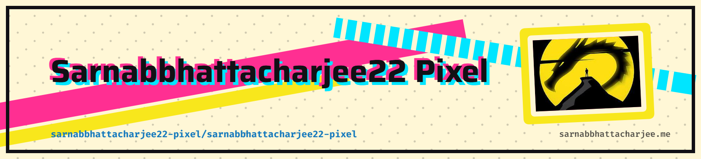

<picture>
   <source media="(prefers-color-scheme: dark)" srcset="header-dark.png">
   
</picture>

 

 

---

  <h3 align="center">02 / ABOUT</h3>
  

    <b>Crafting elegant web architectures and premium digital experiences.</b>  
    Bridging the gap between sophisticated interface design and robust, scalable backend engineering. 
    I build software that balances technical excellence with aesthetic precision.
  

 

---

  <h3 align="center">03 / TECH STACK</h3>
   

<table align="center" width="100%">
  <tr align="center">
    <td width="33%">
       
      <b>◇ LANGUAGES ◇</b>  
      
        
    </td>
    <td width="33%">
       
      <b>◇ FRAMEWORKS ◇</b>  
      
        
    </td>
    <td width="33%">
       
      <b>◇ DATA & TOOLS ◇</b>  
      
        
    </td>
  </tr>
</table>

 

---

  <h3 align="center">04 / WHAT I BUILD</h3>
   

<table align="center" width="100%">
  <tr>
    <td align="center" width="50%">
      <h4>◆ FRONTEND ARCHITECTURE</h4>
      
Modern Web Applications Responsive Interfaces Pixel-Perfect UI/UX

    </td>
    <td align="center" width="50%">
      <h4>◆ BACKEND SYSTEMS</h4>
      
RESTful APIs Secure Authentication Complex Business Logic

    </td>
  </tr>
</table>

 

---

  <h3 align="center">05 / DEVELOPMENT PHILOSOPHY</h3>
   
  <code>DISCOVER</code> ⸺ <code>DESIGN</code> ⸺ <code>BUILD</code> ⸺ <code>TEST</code> ⸺ <code>REFINE</code>
    

---

  <h3 align="center">06 / ENGINEERING ANALYTICS</h3>
   
  
  
  

    
  
  
  

 

---

  <h3 align="center">07 / ACTIVITY</h3>
  
<code>CODE LEAVES A TRACE.</code>

   
  

 

---

  <picture>
    <source
      media="(prefers-color-scheme: dark)"
      srcset="https://raw.githubusercontent.com/sarnabbhattacharjee22-pixel/sarnabbhattacharjee22-pixel/output/github-contribution-grid-snake-dark.svg"
    />
    <source
      media="(prefers-color-scheme: light)"
      srcset="https://raw.githubusercontent.com/sarnabbhattacharjee22-pixel/sarnabbhattacharjee22-pixel/output/github-contribution-grid-snake.svg"
    />
    
  </picture>

 

---

  <h3 align="center">09 / CURRENT FOCUS</h3>
   

> **Architecting** modern frontend systems with clean UI/UX principles. 
> **Engineering** robust backend integrations and scalable APIs. 
> **Refining** database structures for optimal data flow. 
> **Elevating** personal development standards through continuous learning.

 

---

  <h3 align="center">10 / CONNECT</h3>
  
<code>LET'S BUILD SOMETHING.</code>

   
  
  
  
  
  
  
  
  
  
  

    
  <code>OPEN TO IDEAS & COLLABORATION</code>

 

---

  

